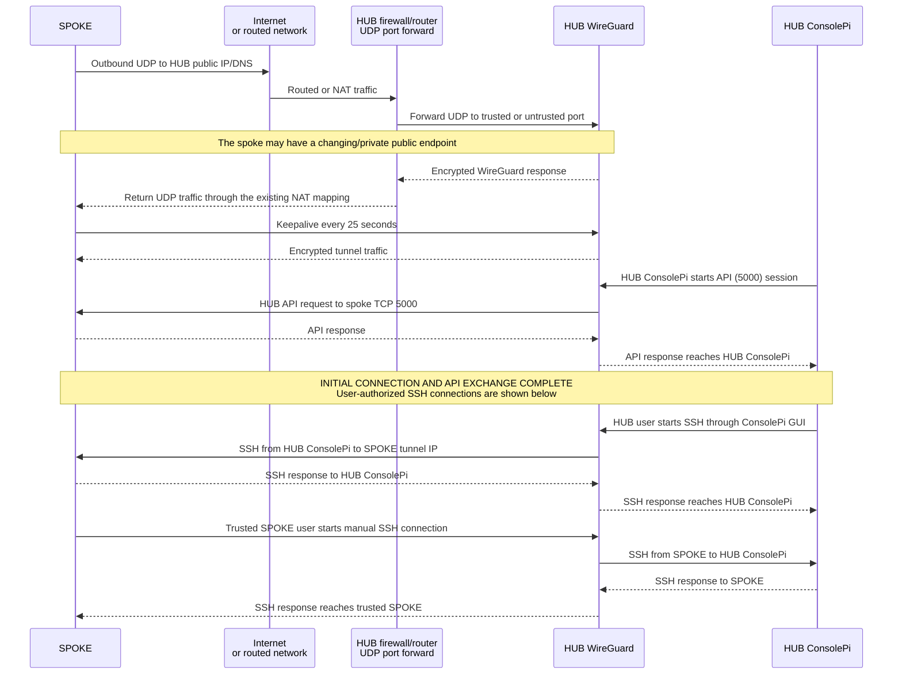

# ConnectPi HUB Docker Stack

This folder contains a Docker Compose based HUB baseline:

- WireGuard runs in the `wireguard-hub` container with trusted and untrusted profiles/interfaces.
- Trusted WireGuard profile: can access ConsolePi.
- Untrusted WireGuard profile: blocked from ConsolePi SSH.
- ConsolePi is a local image build based on Debian 12 Bookworm.

Once the HUB and SPOKE are pointed at each other, most of the runtime layout is deterministic.
The remaining manual inputs are the connection-specific values in `.env` such as profile,
peer slots, tunnel endpoints, and peer keys. See [How the HUB and SPOKE connect](#how-the-hub-and-spoke-connect)
for the complete setup and connection flow.

If `.env` is missing, `deploy-hub.sh` prompts for the management SSH settings and
the trusted/untrusted `/24` subnets, writes a minimal `.env`, and continues.

## 1) Prepare files

One-command deploy helper (recommended):

```bash
chmod +x deploy-hub.sh
./deploy-hub.sh
```

On first run, if the required values are missing, the script prompts for:

- `MGMT_SSH_PORT` default `2222`
- `MGMT_ALLOWED_DIRECT_SSH` default `0.0.0.0/0`

- `WG_TRUSTED_SUBNET` default `10.99.99.0/24`
- `WG_UNTRUSTED_SUBNET` default `10.99.98.0/24`

Optional flags:

- `--without-consolepi`: skip starting the `consolepi` service
- `--refresh-configs`: recreates active `wg-*.conf` files from fresh rendered examples (with timestamped backups)
- `--rebuild`: forces a full no-cache rebuild of the `consolepi` image before start
- `--status`: prints live WireGuard (`wg show` from `wireguard-hub`) and ConsolePi API status, then exits
- `--get-hosts`: import `/etc/hosts` entries into `consolepi/runtime/ConsolePi.yaml` `HOSTS:`
- `--print-hosts`: preview generated `HOSTS:` content without modifying files

`--get-hosts`/`--print-hosts` behavior is configurable via `.env`:

- `HOSTS_MAIN_MENU_PREFIXES`: optional comma-separated hostname prefixes promoted to `show_in_main: true`
  - leave unset for no promotion
  - set it only when you want specific hostnames surfaced in the main menu

Container runtime identity defaults:

- `PUID` defaults to `1000`
- `PGID` defaults to `1000`
- `TZ` is optional; host local time is used by default via `/etc/localtime` bind mount

These are set as defaults in compose, so they are not required in `.env`.
To change them for your deployment, either:

- add `PUID`, `PGID`, and/or `TZ` to `HUB/.env`, or
- export them in your shell before running `docker compose`/`deploy-hub.sh`.

If you set `TZ`, that value overrides host local time inside containers.

WireGuard port defaults:

- `WG_TRUSTED_PORT` defaults to `51821`
- `WG_UNTRUSTED_PORT` defaults to `51820`

These do not need to be present in `.env`. Add them only if you need to override the defaults.

The script renders templates, ensures active config files exist, checks for placeholder keys, applies permissions, and starts WireGuard plus ConsolePi services.

Re-run behavior:

- safe to run repeatedly after editing `.env`
- always force-recreates `wireguard-hub` so updated env/config changes are reloaded
- preserves existing HUB private keys and existing peer public keys by matching `AllowedIPs`
- adds newly rendered peers from updated `WG_*_PEER_IPS` lists
- warns if new peers still have placeholder public keys
- if HUB private key placeholders are detected, generates the missing keys automatically

## How the HUB and SPOKE connect

The HUB is the reachable WireGuard server. Each spoke may be on another LAN, behind a home
router, behind cellular NAT, or at a different site. The spoke does not need a fixed public
IP address. It only needs:

- outbound UDP access to the HUB's public IP address or DNS name
- the correct HUB endpoint, profile port, and HUB public key in its `.env`
- its own private key and tunnel address

The HUB does need to be reachable from the Internet or from the relevant private network:

- forward UDP `51820` to the HUB host for the untrusted profile
- forward UDP `51821` to the HUB host for the trusted profile
- use the actual values if `WG_UNTRUSTED_PORT` or `WG_TRUSTED_PORT` were overridden

The spoke initiates the handshake by sending UDP traffic to the HUB endpoint. WireGuard then
remembers the spoke's latest public endpoint. `PersistentKeepalive=25` sends a small packet
about every 25 seconds, which keeps common NAT mappings open and allows the HUB to return
traffic to a spoke whose address changes. The HUB does not need to know the spoke's public
IP address in advance.

After the initial WireGuard handshake, the HUB ConsolePi API can exchange data with the spoke
over the tunnel. These API requests use the spoke's assigned tunnel IP rather than its changing
public/NAT address:

- HUB-to-SPOKE ConsolePi API traffic uses TCP port `5000` over the WireGuard tunnel.
- The API is intended to remain reachable through the tunnel, not through a public Internet port.

SSH is separate from the WireGuard handshake and API exchange. It is a user-authorized connection
started after the tunnel is established:

- A HUB user may start SSH to a SPOKE tunnel IP through the ConsolePi GUI, using the shared
  `hub_spoke_ed25519` key.
- Only a trusted-profile SPOKE may manually SSH to HUB ConsolePi.
- An untrusted-profile SPOKE may use the tunnel for its permitted traffic, but SSH to HUB ConsolePi
  is blocked by the HUB interface policy.



### Registration and deployment order

The public keys identify the two ends of the tunnel. A public key is not a secret; private keys
must remain on their original device.

1. Deploy the HUB with `./deploy-hub.sh`. It creates the trusted and untrusted WireGuard interfaces,
  assigns each interface a `.1` tunnel address, and starts the WireGuard container.
1. Deploy the SPOKE with `./deploy-spoke.sh`. Choose `trusted` or `untrusted`, set the HUB endpoint,
  and let the script generate the spoke keypair and rendered WireGuard profile.
1. Copy or note the spoke public key printed by the spoke deployment.
1. On the HUB, run `./wireguard/register-peer.sh` and choose the same profile and slot.
  The slot determines the spoke tunnel IP: slot `2` becomes `.12`.
1. When prompted for the HUB name, press Enter to accept the profile-specific default:
  `spoke-u-02` for untrusted slot `2` or `spoke-t-02` for trusted slot `2`.
  You can enter a custom name instead. This name is a peer comment and snippet label; it does
  not affect routing or authentication.
1. Re-deploy the HUB so the registered public key is present in the active WireGuard configuration.
1. Apply or re-render the SPOKE profile, then start or restart `wg-quick@wg0` on the spoke.
1. Verify both ends with `wg show`. A successful handshake confirms WireGuard connectivity;
  the tunnel IP and profile policy determine what the spoke may access.

Example address allocation with the default subnets:

| Profile | HUB tunnel IP | Slot 2 spoke IP | UDP port | ConsolePi SSH |
| --- | --- | --- | --- | --- |
| Trusted | `10.99.99.1` | `10.99.99.12` | `51821` | Allowed |
| Untrusted | `10.99.98.1` | `10.99.98.12` | `51820` | Blocked |

The HUB and spoke must use matching profile, slot, subnet, and keys. A trusted spoke pointed at
the untrusted subnet, or a slot registered with the wrong public key, will not produce the
expected connection.

1. Optional: copy `.env.example` to `.env` if you want to preseed values before first deploy.
1. Render profile templates from `.env`:

```bash
chmod +x wireguard/render-profile-configs.sh
./wireguard/render-profile-configs.sh
```

To register a new spoke peer on the HUB after initial setup:

```bash
chmod +x wireguard/register-peer.sh
./wireguard/register-peer.sh
```

The helper will:

- ask for trusted or untrusted profile
- ask for peer slot index, optional hub name, and peer public key
- update the matching `WG_*_PEER_KEY_N` slot in `.env`
- rerender the example templates
- append the live peer stanza to the active hub config if it exists
- otherwise write a ready-to-paste snippet under `wireguard/profiles/`

## 2) Start WireGuard

```bash
docker compose up -d wireguard-hub
```

## 3) Verify

```bash
docker compose ps
docker compose logs --tail=100 wireguard-hub
```

You should see interface startup and peer activity once spokes connect.

## 3a) Build and run ConsolePi container

Build the image:

```bash
docker compose build consolepi
```

Start the service:

```bash
docker compose up -d consolepi
```

Open an interactive shell and run ConsolePi commands:

```bash
docker compose exec consolepi bash
consolepi-menu
```

Trusted WireGuard peers can reach ConsolePi over the hub WireGuard IP using SSH:

- target: trusted profile hub IP on port `22` (for example `10.99.99.1:22`)
- username: `consolepi`
- authentication: key only

Edit `./consolepi/ssh/authorized_keys` and add your admin public key before starting the container.

Optional multi-user password access:

- Enable in `.env`: `CONSOLEPI_SSH_PASSWORD_AUTH=true`
- Keep a tight external allow-list in `MGMT_ALLOWED_DIRECT_SSH`
- The built-in `consolepi` account is always allowed for key-based login via `./consolepi/ssh/authorized_keys`
- Additional login users are derived from `./consolepi/ssh/users.conf`
- Keep `CONSOLEPI_GRANT_SUDO=true` if those users need `consolepi-menu` Python mode
- For users with `mode=menu`, SSH uses `ForceCommand` to enter menu directly
- Set `CONSOLEPI_MENU_EXIT_ACTION=logout` (default) to close session when menu exits
- Set `CONSOLEPI_MENU_EXIT_ACTION=shell` only if you want menu users to fall back to shell
  - `CONSOLEPI_MENU_NOPASSWD_SUDO=true` grants passwordless sudo for `mode=menu` users only
  so `consolepi-menu` can run in forced-command mode without prompt failures
- Edit the provided `./consolepi/ssh/users.conf` with one entry per line:
  - `username:mode:password_hash`
  - mode values: `menu` or `shell`
  - backward compatible `username:password_hash` format is treated as `shell`
- Generate password hashes with:

```bash
openssl passwd -6 'StrongPasswordHere'
```

- Example `users.conf`:

```text
opsadmin:menu:$6$rounds=656000$abc...$xyz...
nocadmin:shell:$6$rounds=656000$def...$uvw...
```

Re-deploy after changes so users and auth policy are applied.

Automatic host-user SSH key import (recommended):

- each `deploy-hub.sh` run scans host users from `/etc/passwd` with home paths under `/home/*` (and `/root`), then copies each found `~/.ssh/authorized_keys` into `consolepi/ssh/system-users/<username>.authorized_keys`
- on container start, matching users are created/updated inside ConsolePi and each imported key file is installed to that same username
- imported users are allowed over SSH and password login is locked for those users (key-based auth only)
- imported users default to menu mode (ForceCommand launches ConsolePi menu on SSH login)
- this lets you use Ubuntu host user key assignments directly, without maintaining `users.conf` for key-only access

HUB-to-SPOKE passwordless SSH key (auto-generated):

- `deploy-hub.sh` now generates `./consolepi/ssh/hub_spoke_ed25519` and `./consolepi/ssh/hub_spoke_ed25519.pub` if missing
- the static HUB-to-SPOKE remote user is `consolepi`
- `ConsolePi.yaml` `rem_user` is updated to that same user on each deploy
- use the generated public key value when running SPOKE deploy so HUB->SPOKE remote shell works without password prompts

`users.conf` remains supported as an optional fallback for explicit password-hash + mode (`menu`/`shell`) provisioning.
For legacy two-field entries (`username:password_hash`), the default mode is now `menu`.

Optional override:

- set `CONSOLEPI_DEFAULT_USER_MODE=shell` in `.env` if you prefer shell mode as the default for imported users and two-field `users.conf` entries.

SSH access is profile-restricted at interface level:

- trusted interface (`TRUSTED_SSH_INTERFACE`) is allowed
- untrusted interface (`UNTRUSTED_SSH_INTERFACE`) is denied

No per-IP allowlist management is required.

Dedicated external management SSH port is also exposed on the host:

- host port: `MGMT_SSH_PORT` (default `2222`)
- container target: `22`
- source restriction: `MGMT_ALLOWED_DIRECT_SSH` (comma-separated CIDRs)

Set `MGMT_ALLOWED_DIRECT_SSH` in `.env` to your management source(s), then connect:

```bash
ssh -p 2222 consolepi@<HUB_PUBLIC_IP_OR_DNS>
```

## 3b) Two WireGuard access profiles (A/B)

Use two client profile classes:

- Profile A (untrusted): VPN tunnel up, but blocked from ConsolePi SSH.
- Profile B (trusted): VPN tunnel up and permitted to access ConsolePi SSH.

`render-profile-configs.sh` generates one client profile example for each registered peer slot
under `wireguard/profiles/`. Untrusted profiles use the `profile-A<N>-untrusted.conf.example`
pattern; trusted profiles use `profile-B<N>-trusted.conf.example`.

Hub tunnel templates are also provided:

- `wireguard/trusted/config/wg_confs/wg-trusted.conf.example`
- `wireguard/untrusted/config/wg_confs/wg-untrusted.conf.example`

Network pools are driven by `.env` values:

- `WG_TRUSTED_SUBNET` (default `10.99.99.0/24`)
- `WG_UNTRUSTED_SUBNET` (default `10.99.98.0/24`)
- `WG_TRUSTED_PEER_KEY_N` (trusted peer slot N)
- `WG_UNTRUSTED_PEER_KEY_N` (untrusted peer slot N)

HUB tunnel interface IPs are auto-derived from subnets (host `.1` in each `/24`):

- trusted HUB IP: derived from `WG_TRUSTED_SUBNET` (for example `10.99.99.1`)
- untrusted HUB IP: derived from `WG_UNTRUSTED_SUBNET` (for example `10.99.98.1`)

Peer tunnel IPs are auto-derived from slot index within each /24 subnet:

- slot `1` => host `.11`
- slot `2` => host `.12`
- slot `3` => host `.13`
- formula: host `.(10 + N)`

Only slots with a non-empty `*_PEER_KEY_N` are rendered into HUB and spoke profile templates.

You can also use the HUB registration helper non-interactively:

```bash
./wireguard/register-peer.sh \
  --profile trusted \
  --slot 4 \
  --hub-name spoke-b4 \
  --public-key <SPOKE_PUBLIC_KEY>
```

## 4) FortiGate alignment

- Forward UDP 51820 (untrusted) and UDP 51821 (trusted) to this host.
- Forward TCP `MGMT_SSH_PORT` (default 2222) to this host for external ConsolePi management.
- Allow inbound policies for both UDP ports.
- Restrict inbound TCP `MGMT_SSH_PORT` policy to your management source addresses.
- Ensure app control does not block WireGuard.

## 5) Important runtime notes

- The `consolepi` service is included in normal compose lifecycle operations.
- It uses `network_mode: service:wireguard-hub` so ConsolePi shares the namespace that hosts both trusted and untrusted WG interfaces.
- Runtime data is persisted under `./consolepi/runtime`.
- SSH material (authorized keys / users.conf) is persisted under `./consolepi/ssh`.
- ConsolePi logs are persisted under `./consolepi/log` (mounted to `/var/log/ConsolePi` in container).
- Inbound SSH for ConsolePi is provided by the ConsolePi container itself and is reachable through the shared WireGuard namespace.
- Untrusted profile clients are blocked from SSH by interface policy applied at container startup.

## 6) Isolation model in this stack

- Each spoke peer should remain `/32` in `AllowedIPs`.
- Keep trusted and untrusted peers in separate profile subnets and interfaces within the
  `wireguard-hub` container.
- The generated trusted and untrusted interfaces add an explicit `wg -> wg` forwarding drop,
  preventing one spoke from reaching another through the HUB.
- ConsolePi SSH access is separately filtered by interface: trusted peers are allowed and
  untrusted peers are denied.
- Spoke ConsolePi API access uses TCP `5000` over the tunnel and is not exposed as a public port.

The current Docker deployment owns WireGuard configuration, key generation, interface setup,
permissions, and isolation rules. Do not create a separate host `wg0.conf`, manually copy the
generated profile files, or apply the old single-interface forwarding instructions. Use
`deploy-hub.sh` and `deploy-spoke.sh` so both sides stay aligned with the trusted/untrusted design.

For a basic post-deployment check:

```bash
docker compose ps
docker compose exec wireguard-hub wg show
docker compose logs --tail=100 wireguard-hub
```

On a trusted spoke, verify the HUB ConsolePi API over the tunnel. On an untrusted spoke, verify
the WireGuard handshake and permitted tunnel traffic, but expect SSH to HUB ConsolePi to fail.
